<!-- title: KCSE2026 -->

<head>

<meta name="viewport" content="width=device-width, initial-scale=1" />
</head>

  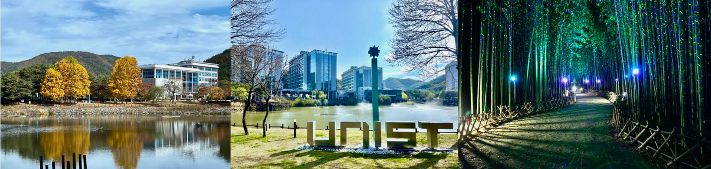

<h1 align="center">2026 한국 소프트웨어공학 학술대회 (KCSE 2026)  소프트웨어 공학 가치의 확산: DevSecOps, MLSecOps, 그리고 그 너머</h1>

[[행사개요](#행사개요)] [[모시는 글](#모시는-글)] [[오시는 길](#오시는-길)] [[참가 등록](#참가-등록)] [[논문 모집 분야](#논문-모집-분야)] [[논문 접수](#논문-접수)] [[주요 일정](#주요-일정)] [[논문 및 제안서 제출](#논문-및-제안서-제출)] [[기조연설](#기조연설)] [[튜토리얼](#튜토리얼)] [[신진 연구자](#신진-연구자)] [[초청 우수 논문](#초청-우수-논문)] [[특별 행사](#특별-행사)] [[근처 가볼만한 곳](#근처-가볼만한-곳)] [[조직위원](#조직위원)] [[학술위원](#학술위원)]

## 행사개요

- 일시: 2026년 2월 4일 (수) ~ 2월 6일 (금)
- 주최: 한국정보과학회, 한국정보처리학회
- 주관: 한국정보과학회 소프트웨어공학 소사이어티, 한국정보처리학회 소프트웨어공학연구회
- 장소: UNIST (울산과학기술원) 114동 경영관 (참조: [캠퍼스 지도](images/campus-map.jpg))

## 모시는 글

한국정보과학회와 한국정보처리학회가 공동 주최하고 한국정보과학회의 소프트웨어공학 소사이어티와 한국정보처리학회의 소프트웨어공학 연구회가 공동 주관하는 “제 28회 한국 소프트웨어공학 학술대회 (KCSE 2026)”가 2026년 2월 4일 (수)부터 2월 6일 (금)까지 UNIST에서 개최됩니다. DevOps, MLOps, DevSecOps, MLSecOps와 같은 다양한 신조어의 등장은 소프트웨어공학의 개념과 가치가 개발뿐 아니라, 보안, 인공지능, 데이터 등 컴퓨터공학의 여러 분야로 확장되고 융합되고 있음을 보여줍니다. 소프트웨어공학적 관점과 접근법은 이제 여러 분야의 연구와 실무에서 새로운 형태로 해석되고 적용되며 그 영향력을 넓혀가고 있습니다. 이번 KCSE 2026에서는 이러한 변화의 흐름 속에서 소프트웨어공학의 가치가 어떻게 재해석되고 확산되며, 다양한 분야와 어떻게 연결되어 새로운 시너지를 만들어내는지를 함께 논의하고자 합니다. 학계와 산업계의 연구자와 실무자 여러분의 많은 관심과 참여를 부탁드립니다.

## 오시는 길

- 울산(통도사)역 하차 후 택시로 약 10분 소요

## 후원사

<table class="sponsor-table">
  <tr class="sponsor-gold">
    <td><strong>골드</strong></td>
    <td colspan="2">
      
    </td>
  </tr>
  <tr class="sponsor-silver">
    <td><strong>실버</strong></td>
    <td>
      
    </td>
    <td>
      
    </td>
  </tr>
  <tr class="sponsor-bronze">
    <td><strong>브론즈</strong></td>
    <td colspan="2">
      

        
        
        
        
        <a href="https://www.tta.or.kr/">
          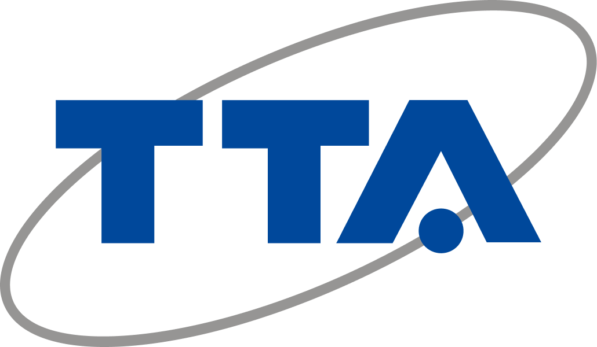
        </a>
        
      

    </td>
  </tr>
</table>

## 참가 등록

참가등록비(조식 2회, 중식 1회, 석식 2회 포함)

| 구분 | 일반 | 학생 | 학부/주니어 |
| --- | --- | --- | --- |
| 사전등록(1.21) | 260,000원 | 200,000원 | 90,000원 |
| 현장등록 | 280,000원 | 220,000원 | 110,000원 |

- 한국정보과학회 회원/비회원 참가비 동일
- 사전등록 사이트: [https://www.kiise.or.kr/conference/conf/183/](https://www.kiise.or.kr/conference/conf/183/) (2026년 1월 21일 (수)까지)
- 참가등록문의: 한국정보과학회 문은정 차장 (Email: ejmoon@kiise.or.kr, Tel. 02-588-4002)
  - 납입증명서, 참가확인서(행사종료 후) 요청 가능
- 기타문의
  - 행사관련 문의: UNIST 이주용 교수 (Email: jooyong@unist.ac.kr)
  - 논문관련 문의: UNIST 김미정 교수 (Email: mijungk@unist.ac.kr)

## 논문 모집 분야

다음에 나열된 분야를 포함한 소프트웨어공학 전 분야의 논문을 모집합니다.

논문 모집 분야 보기

<ul>
  <li>AI for Software Engineering</li>
  <li>Low Code, No Code, and Auto-coding</li>
  <li>Agile Methodologies</li>
  <li>Autonomic and (self-) Adaptive Systems</li>
  <li>Blockchain Platform/Blockchain-based Software Systems</li>
  <li>Cloud and Service-Oriented Computing</li>
  <li>Component-based Software Engineering</li>
  <li>Configuration Management and Deployment</li>
  <li>Cooperative, Distributed, and Collaborative Software Engineering</li>
  <li>Debugging, Fault Localization, and Repair</li>
  <li>Dependability, Safety, and Reliability</li>
  <li>Embedded & Realtime Systems</li>
  <li>Empirical Software Engineering</li>
  <li>End-user Software Engineering</li>
  <li>Formal Methods</li>
  <li>Green and Sustainable Technologies</li>
  <li>Human Factors and Social Aspects of Software Engineering</li>
  <li>IoT and CPS</li>
  <li>Middleware, Frameworks, and APIs</li>
  <li>Mining Software Repository</li>
  <li>Mobile and Pervasive Software Systems</li>
  <li>Model-Driven and Domain Specific Engineering</li>
  <li>Parallel, Distributed, and Concurrent Systems</li>
  <li>Program Languages and Systems</li>
  <li>Refactoring</li>
  <li>Requirements Engineering</li>
  <li>Reverse Engineering</li>
  <li>Search-based Software Engineering</li>
  <li>Security, Privacy, and Trust</li>
  <li>Software Architecture, Modeling, and Design</li>
  <li>Software Comprehension, Visualization, and Traceability</li>
  <li>Software Economics and Metrics</li>
  <li>Software Engineering Education</li>
  <li>Software Engineering for AI</li>
  <li>Software Engineering for Hyper-Connectivity, Super-Intelligence, and Hyper-Convergence</li>
  <li>Software Evolution and Maintenance</li>
  <li>Software Process and Standards</li>
  <li>Software Product Line Engineering</li>
  <li>Software Reuse</li>
  <li>Software Safety and Reliability</li>
  <li>System of Systems</li>
  <li>Testing, Verification, and Validation</li>
</ul>

## 논문 접수

논문 성격에 따라 아래와 같은 트랙으로 구분하여 접수합니다.

- 일반 (Regular) 논문: 대학, 연구소 또는 기업에서 수행한 이론, 실험, 아이디어 제시 위주의 논문 (8-10쪽)
- 단편 (Short) 논문: 대학, 연구소 또는 기업에서 수행한 이론, 실험, 아이디어 제시 위주의 논문 (2-4쪽)
- 산업체 논문: 소프트웨어 공학의 각종 기법을 실제 업무에 적용한 논문 (4-8쪽 논문 또는 발표자료)
- 학부생 논문: 학부생이 수행한 프로젝트, 이론/실험, 아이디어 위주의 논문 (4-8쪽 논문 또는 발표자료)
- 튜토리얼 제안서: 개인이나 팀을 구성하여 제안

※ 트랙별 우수논문을 선정하여 시상할 예정이며, 제출된 일반논문 중 우수논문을 선정하여 한국정보과학회 논문지 및 한국정보처리학회 논문지에 게재 추천

## 주요 일정

- 논문 접수 마감: ~~2025년 12월 23일 (화), 12월 30일 (화)~~ 2026년 1월 13일 (화) (최종 마감)
- 튜토리얼 제안서 접수: 2025년 12월 30일 (화)
- 심사 결과 통보: 2026년 1월 19일 (월)
- 최종 원고 제출: 2026년 1월 26일 (월)

## 논문 및 제안서 제출

- 논문 양식: [http://sigsoft.or.kr/category/자료실/기타/](http://sigsoft.or.kr/category/자료실/기타/)
- 논문 제출 사이트: [https://easychair.org/conferences?conf=kcse2026](https://easychair.org/conferences?conf=kcse2026)
- 튜토리얼 제안서는 학술위원장에게 이메일로 제출해주시기 바랍니다.
- 기타 문의 사항 연락처: 학술위원장 UNIST 김미정 (mijungk@unist.ac.kr)

## 기조연설

- 2월 4일 (수): 박인욱 (LG 전자)
  

    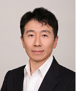
    <ul class="speaker-info">
      <li>강연 제목: <strong>AI-Native DevOps: What Should We Do — Accelerating Software Engineering with Shift-Left, CI/CD, and IDP</strong></li>
      <li>초록: AI-Native DevOps의 핵심은 “새로운 도구 나열”이 아니라 기존 SW공학의 가속과 표준화다. SW 개발의 핵심인 Shift-Left 와 CI/CD 전략을 개발자 역량의 연장선으로 보고, 이를 포함한 SDLC를 IDP(Internal Developer Platform) 위에서 AI 지원을 통해 일관된 가드레일과 골든 패스로 제공하는 방향을 제시한다. 결과적으로, 사람의 역량 × IDP  × AI 의 증폭으로 속도와 신뢰를 동시에 끌어올리는 실행 프레임을 제시한다.</li>
      <li>연설자 소개: 박인욱 상무는 현재 LG전자 webOS SW개발그룹 DevOps 개발실장으로, 제조사에 DevOps를 도입하여 정착·고도화하고, webOS Re:New 업그레이드 프로그램과 DevSecOps·플랫폼 엔지니어링·AI 기반 생산성 혁신을 이끌고 있다.</li>
    </ul>
  

   
- 2월 5일 (목): [이희조 (고려대학교)](https://ccs.korea.ac.kr/people/heejo/)
  

    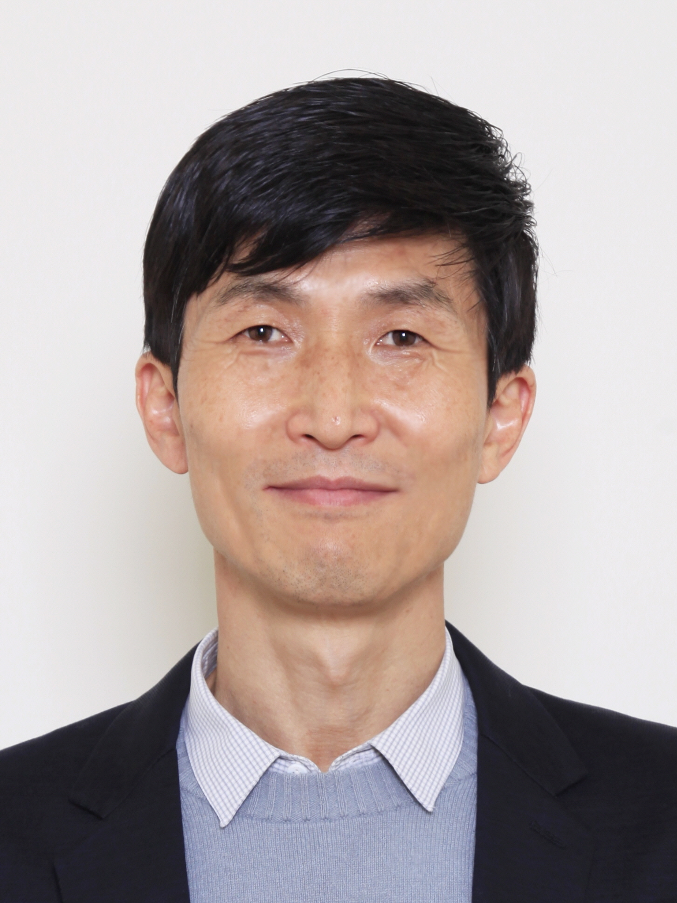
    <ul class="speaker-info">
      <li>강연 제목: <strong>보이지 않던 소프트웨어를 투명하게: SBOM과 취약점 관리가 던지는 질문</strong></li>
      <li>초록: 소프트웨어 공급망 공격이 증가하면서, 소프트웨어는 더 이상 “잘 동작하는가”만으로 평가되기 어려워졌다. 최근 미국과 유럽을 중심으로 강화되고 있는 제품 보안 및 공급망 보안 규제는, 소프트웨어가 "무엇으로 구성되어 있는지(SBOM)"와 발견된 취약점이 실제로 어떤 영향을 미치는지를 설명할 것을 요구하고 있다.</li>
      <li>연설자 소개: 이희조 교수는 고려대학교 정보대학 컴퓨터학과 교수이자 소프트웨어보안연구소(CSSA) 연구소장으로, 지난 20여 년간 국가·산업·학계를 아우르며 공급망 보안과 취약점 분석 기술 연구, 보안 인재 양성에 힘써왔다. 안랩 CTO를 역임했으며, 현재는 고려대학교 기술지주 자회사 ㈜래브라도랩스 공동대표로서 SBOM 및 오픈소스 보안 솔루션의 확산을 추진하고 있다.</li>
    </ul>
  

   
- 2월 6일 (금): [최재식 (KAIST)](https://sailab.kaist.ac.kr/members/jaesik/)
  

    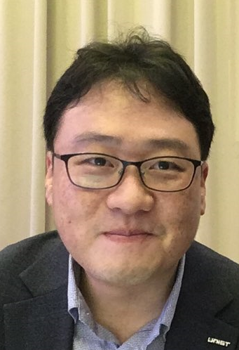
    <ul class="speaker-info">
      <li>강연 제목: <strong>설명가능 인공지능을 통한 대형 인공지능 모델의 기능 및 안전성 확인</strong></li>
      <li>초록: 대형인공지능모델(혹은 대형언어모델, LLMs: Large Language Models)이 많은 응용 분야에 활용되고 있다. 이런 LLM의 장점과 함께 거짓답변(hallucination)과 같은 문제는 근본적인 원인 뿐만 아니라 해결이 어려운 면이 있다. 최근 설명가능 인공지능의 발전은 이런 LLM 내부를 확인하고 그 의사 결정을 명확히 하는데 기여하고 있다. 이 강의에서는 이런 설명성 기술이 LLM에 적용되는 최근 기술과 연구 동향을 소개한다.</li>
      <li>연설자 소개: 최재식 교수는 KAIST 김재철AI대학원 석좌교수(㈜인이지 대표이사)이자 설명가능 인공지능(XAI) 연구자로, 한국공학한림원 회원으로 활동하며 산업부 제조 AI 전환(M.AX) 얼라이언스 총괄위원으로서 국가 AI 정책 수립과 제조업 AI 전환에 기여하고 있다.</li>
    </ul>
  

## 튜토리얼

- [박상돈 (POSTECH)](https://sangdon.github.io/)
  

    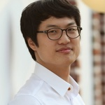
    <ul class="speaker-info">
      <li>튜토리얼 주제: <strong>AI red teaming</strong></li>
      <li>초록: 추후 공고</li>
      <li>연설자 소개: 추후 공고</li>
    </ul>
  

   

- [지은경 (KAIST)](https://sites.google.com/se.kaist.ac.kr/ekjee)
  

    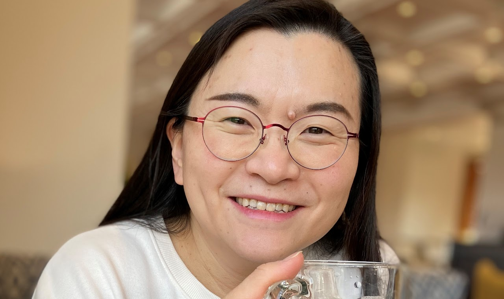
    <ul class="speaker-info">
      <li>튜토리얼 주제: <strong>원자력 분야 Software safety</strong></li>
      <li>초록: 추후 공고</li>
      <li>연설자 소개: 추후 공고</li>
    </ul>
  

   

- [김진현 (경상대학교)](https://jin-kim.net/)
  

    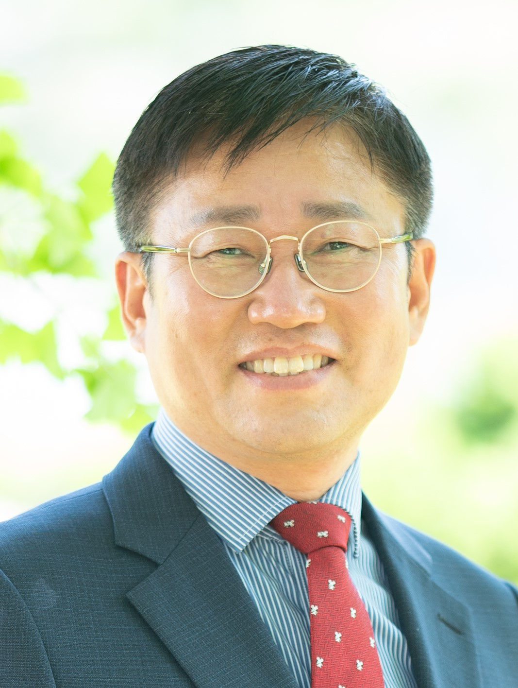
    <ul class="speaker-info">
      <li>튜토리얼 주제: <strong>Roboracer AI 경주 로봇</strong></li>
      <li>초록: 추후 공고</li>
      <li>연설자 소개: 추후 공고</li>
    </ul>
  

   

## 신진 연구자

- [안가빈 (고려대학교)](https://agb94.github.io/)
  

    
    <ul class="speaker-info">
      <li>강연 주제: <strong>대규모 소프트웨어에서 바늘을 찾다: LLM 기반 결함 위치 식별의 산업 적용</strong></li>
      <li>초록: 대규모 소프트웨어에서 결함 위치를 찾는 일은 여전히 큰 도전 과제이다. 본 강연에서는 LLM 에이전트를 활용한 AutoFL 시리즈를 통해, 설명 가능한 결함 위치 식별 연구가 어떻게 산업 규모 소프트웨어의 크래시 분석으로 확장될 수 있는지를 소개한다. 이를 통해 LLM 기반 자동 디버깅 기법의 가능성과 한계를 함께 논의한다</li>
      <li>연설자 소개: 안가빈 교수는 고려대학교 정보대학 컴퓨터학과 조교수로, AI 기반 소프트웨어 공학 연구를 주로 수행하고 있다. 주요 연구 분야는 대형 언어 모델을 활용한 자동 디버깅, 결함 위치 식별, 그리고 소프트웨어 테스트 및 유지보수 자동화이다. 산업 규모의 실제 소프트웨어 시스템을 대상으로 신뢰 가능한 자동 분석 기법을 개발하는 데 주력하고 있다.</li>
    </ul>
  

   

- [유명성 (서울시립대학교)](https://sites.google.com/view/tnslab/faculty?authuser=0)
  

    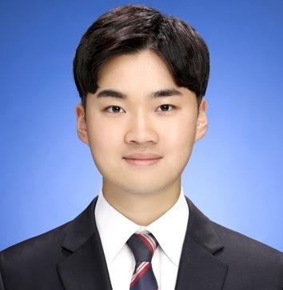
    <ul class="speaker-info">
      <li>강연 주제: 추후 공고</li>
      <li>초록: 추후 공고</li>
      <li>연설자 소개: 추후 공고</li>
    </ul>
  

   

- 신용준 (ETRI)
  

    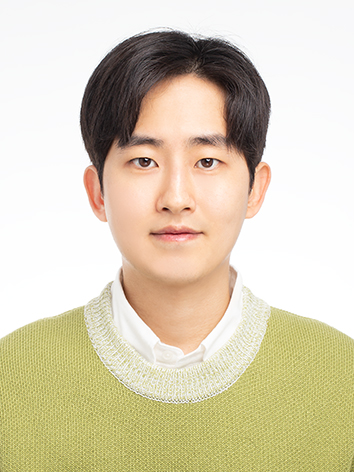
    <ul class="speaker-info">
      <li>강연 주제: <strong>로보틱스 소프트웨어의 원인-결과 체인 지연시간 검증</strong></li>
      <li>초록: 로보틱스 소프트웨어의 원인-결과 체인 지연시간 검증은 시스템의 반응성 및 안전성 보장을 위해 필수적이나, 체인 구성 요소의 실행 비결정성과 소스코드 비가시성은 신뢰 가능한 검증을 어렵게 만든다. 본 강연에서는 이러한 어려움을 고려한 (1) 원인-결과 체인 지연시간 검증을 위한 모델 기반 접근, (2) 블랙박스 원인-결과 체인의 런타임 지연시간 검증 알고리즘, (3) ROS 2 소프트웨어를 대상으로 한 런타임 검증 도구를 소개한다.</li>
      <li>연설자 소개: 신용준 박사는 한국과학기술원(KAIST)에서 공학박사 학위를 취득하고, 현재 한국전자통신연구원(ETRI)에 선임연구원이자 AI전문교수로 재직 중이며 로보틱스 및 모빌리티 소프트웨어의 안전성 검증 기술을 연구하고 있다. 주요 연구 관심 분야는 자율행동체를 위한 모델 기반 소프트웨어 공학, 런타임 검증 및 안전 제약, 지속적 통합/배포 등이다.</li>
    </ul>
  

     

## 초청 우수 논문

| 논문제목 | 학회 | 발표자 | 소속 |
| ------ | --- | ---- | --- |
| LOSVER: Line-Level Modifiability Signal-Guided Vulnerability Detection and Classification | ASE 2025 | 남도하 | KAIST |
| Automated Attack Synthesis for Constant Product Market Makers | ISSTA 2025 | 한수진 | KAIST |
| An Empirical Study of Web Flaky Tests: Understanding and Unveiling DOM Event Interaction Challenges | ICST 2025 | 손정주 | 경북대학교 | 
| Fork State-Aware Differential Fuzzing for Blockchain Consensus Implementations | ICSE 2025 | 김원회 | KAIST |
| Collaboration failure analysis in cyber-physical system-of-systems using context fuzzy clustering | EMSE 2025 | 현상원 | KAIST |
| Automated code-based test case reuse for software product line testing | ICST 2024 | 정필수 | 경상대학교 | 
| Forcrat: Automatic I/O API Translation from C to Rust via Origin and Capability Analysis | ASE 2025 | 홍재민 | KAIST | 
| TopSeed: Learning Seed Selection Strategies for Symbolic Execution from Scratch | ICSE 2025 | 이재혁 | 성균관대학교 | 
| Can We Trust the Actionable Guidance from Explainable AI Techniques in Defect Prediction? | SANER 2025 | 이기찬 | 한양대학교 | 

## 특별 행사

- [태화강 국가정원 은하수길 산책](https://www.ulsan.go.kr/s/garden/bbs/view.ulsan?bbsId=BBS_0000000000000165&mId=001002001000000000&dataId=27101): 전국에 단 2개뿐인 국가정원 중 하나인 태화강 국가정원 내 은하수길을 산책하며 학회 참석자들 간의 교류와 네트워킹의 시간을 갖습니다.
  

    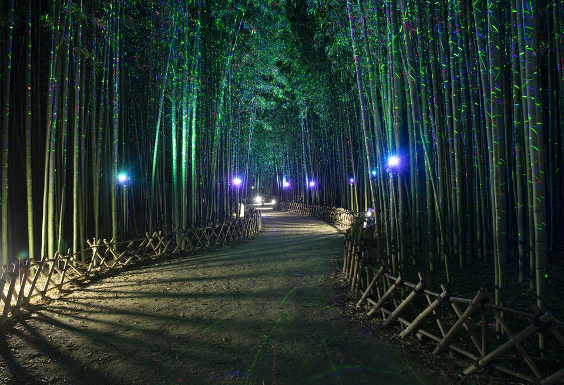
    <ul class="speaker-info">
      <li>일시: 2월 4일 (학회 첫째날)</li>
      <li>장소: 태화강 국가정원 은하수길</li>
      <li>시간: 저녁 식사 후 (셔틀 서비스 제공 예정)</li>
      <li>비고: 공원 근처에 몸을 녹일 수 있는 카페와 식당이 다수 위치해 있습니다.</li>
    </ul>
  
  
   

- **IITP 공청회:** IITP에서 추진 중인 AI 네이티브 SW 산업혁신기술개발 사업과 관련하여 공청회를 개최합니다. 본 공청회에서는 사업의 개요와 목표, 기대효과 등에 대해 소개하고, SW공학 전문가들의 의견을 수렴하는 시간을 가질 예정입니다.
  

    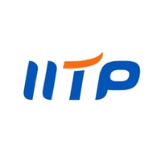
    <ul class="speaker-info">
      <li>주제: <strong>AI 네이티브 SW 산업혁신기술개발 사업</strong></li>
      <li>개요: 추후 공고</li>
      <li>일시: 2월 5일 (학회 둘째날)</li>
    </ul>
  

## 근처 가볼만한 곳

- [영남알프스 얼음골 케이블카](http://icevalleycablecar.com/): 영남 알프스 천황산으로 올라가는 케이블카
- [울산 대왕암 공원](https://daewangam.donggu.ulsan.kr/): 울산 바닷가의 대표적인 관광지로, 아름다운 해안 절경과 함께 산책로가 잘 조성되어 있습니다.
- [통도사](https://tongdosa.or.kr/): 해인사, 송광사와 함께 한국의 3대 사찰로 꼽히는 유서 깊은 사찰
- [에덴벨리 스키장](https://www.edenvalley.co.kr/ski/View.asp?location=01): 대한민국 최남단 스키장
- 부산: 울산(통도사)역에서 KTX로 약 20분 거리
  

## 조직위원

조직위원 보기

<ul>
  <li>이정원 대회장 (아주대학교)</li>
  <li>유준범 대회장 (건국대학교)</li>
  <li>이주용 조직 위원장 (UNIST)</li>
  <li>김미정 학술 위원장 (UNIST)</li>
  <li>홍신 재무 위원장 (충북대학교)</li>
  <li>남재창 Web 위원장 (한동대학교)</li>
  <li>김영재 Web 위원장 (UNIST)</li>
  <li>배경민 튜토리얼 위원장 (POSTECH)</li>
  <li>강종구 신진연구자 세미나 위원장 (성신여자대학교)</li>
</ul>

## 학술위원

학술위원 명단 보기

<ul>
  <li>강종구 (성신여대)</li>
  <li>고인영 (KAIST)</li>
  <li>김기섭 (DGIST)</li>
  <li>김동선 (고려대)</li>
  <li>김문주 (KAIST)</li>
  <li>김윤호 (한양대)</li>
  <li>김정아 (가톨릭관동대)</li>
  <li>김진대 (서울과학기술대)</li>
  <li>김진현 (경상대)</li>
  <li>김태호 (IITP)</li>
  <li>김택수 (삼성전자)</li>
  <li>김형석 (충남대)</li>
  <li>남재창 (한동대)</li>
  <li>류덕산 (전북대)</li>
  <li>마유승 (ETRI)</li>
  <li>박수진 (서강대)</li>
  <li>박지훈 (충남대)</li>
  <li>배경민 (POSTECH)</li>
  <li>백종문 (KAIST)</li>
  <li>서영석 (영남대)</li>
  <li>손정주 (경북대)</li>
  <li>송지영 (한남대)</li>
  <li>안가빈 (고려대)</li>
  <li>안성수 (경상대)</li>
  <li>양근석 (한경대)</li>
  <li>오학주 (고려대)</li>
  <li>유명성 (서울시립대)</li>
  <li>유신 (KAIST)</li>
  <li>유준범 (건국대)</li>
  <li>운회진 (협성대)</li>
  <li>이선아 (경상대)</li>
  <li>이우석 (한양대)</li>
  <li>이은서 (국립경국대)</li>
  <li>이은주 (경북대)</li>
  <li>이재권 (강원대)</li>
  <li>이정원 (아주대)</li>
  <li>이지현 (전북대)</li>
  <li>이찬근 (전북대)</li>
  <li>이희진 (동양미래대)</li>
  <li>정우성 (서울교대)</li>
  <li>정필수 (경상대)</li>
  <li>지은경 (KAIST)</li>
  <li>차상길 (KAIST)</li>
  <li>차수영 (성균관대)</li>
  <li>채홍석 (부산대)</li>
  <li>최윤자 (경북대)</li>
  <li>허기홍 (KAIST)</li>
  <li>홍신 (충북대)</li>
  <li>홍장의 (충북대)</li>
</ul>

